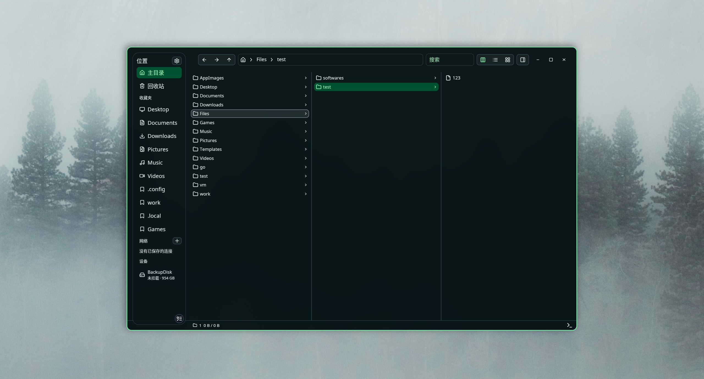
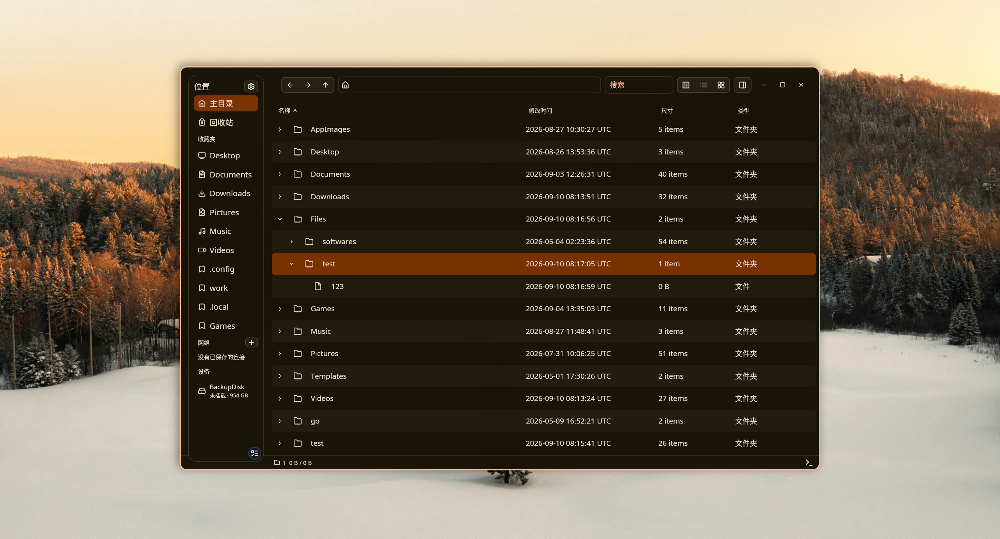
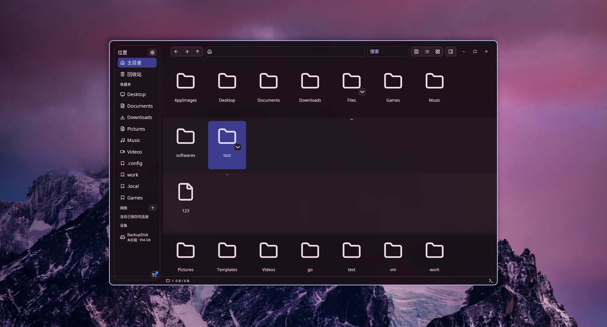
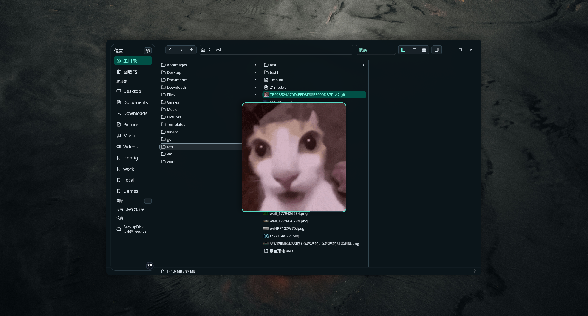
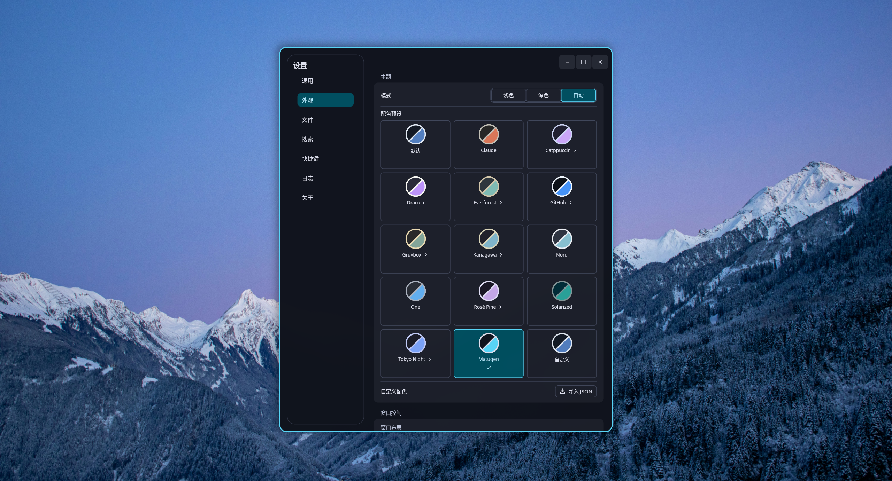

# Bennu

[](https://aur.archlinux.org/packages/bennu-bin)
[](LICENSE)
[](https://t.me/bennu_chat)

English | [简体中文](README.zh-CN.md)

**A Linux file manager that takes file operations seriously**

Written in Rust and built around multi-column browsing, background tasks, indexed search, and content previews.

Developed and tested mainly on Wayland.

[Releases](https://github.com/nsjsv/Bennu/releases) · [AUR](https://aur.archlinux.org/packages/bennu-bin) · [Issues](https://github.com/nsjsv/Bennu/issues) · [Pull Requests](https://github.com/nsjsv/Bennu/pulls) · [License](LICENSE)

## Screenshots

<p align="center">
  
  
</p>
<p align="center"><b>Columns</b> · <b>List view</b></p>

<p align="center">
  
  
</p>
<p align="center"><b>Grid view</b> · <b>Quick preview</b></p>

<p align="center">
  
</p>
<p align="center"><b>Themes &amp; color schemes</b></p>

## Features

- **Multi-column browsing, with a familiar list view too.** Expand directories column by column along the hierarchy, or switch to a list view better suited for scanning and sorting. Tabs and split panes let you work with multiple locations at once.
- **You decide the search scope.** Search the current directory recursively, your Home, or all indexed locations, and add custom indexed directories in Settings. When the background service is unavailable, current-directory search still falls back to a local scan.
- **Take a peek instead of opening another app.** Preview text, Markdown, directory trees, archives, PDF, Office documents, images (including AVIF), audio, and video. Some formats need optional dependencies.
- **Blends into the Linux desktop instead of reinventing it.** Supports GTK bookmarks, UDisks2 storage devices, SMB / WebDAV / SFTP network locations, desktop themes, default apps, and terminal invocation.
- **Everyday details are yours to tune.** Hidden files, startup location, session restore, language, terminal, GPU preference, file checksums, and keyboard shortcuts are all adjustable in Settings. The properties window supports directory statistics and permission changes.

Also included: trash, batch rename, compression and extraction, drag and drop, multi-target file properties, and other everyday operations.

## Installation

### Arch Linux (AUR)

The recommended way is the prebuilt package [bennu-bin](https://aur.archlinux.org/packages/bennu-bin):

```bash
paru -S bennu-bin
```

> Migrating from the old package `file-manager-bin`: just install `bennu-bin`; pacman will offer to remove the old package.
> On first launch the app automatically moves `~/.local/share/file-manager` and `~/.config/file-manager`
> into `bennu/` — tabs, preferences, and history are preserved as-is.

### Debian / Ubuntu

Download the `.deb` from [Releases](https://github.com/nsjsv/Bennu/releases) (Ubuntu 24.04+, Debian 13+):

```bash
sudo apt install ./bennu_0.2.6-1_amd64.deb
```

### Fedora / openSUSE

Download the `.rpm` from [Releases](https://github.com/nsjsv/Bennu/releases):

```bash
sudo dnf install ./bennu-0.2.6-1.*.rpm
```

For other distributions, check [Releases](https://github.com/nsjsv/Bennu/releases) first. If the prebuilt packages don't work for you, build from source below.

The prebuilt packages above never enable the background service automatically, and the optional software needed for PDF/Office, video, and archive previews (poppler, ffmpeg, 7zip, gvfs, etc.) is declared as weak dependencies — install it as needed.

### Enabling indexed search

Packages install `bennu-search.service`. Once enabled, the search service maintains an index of Home and custom locations in the background:

```bash
systemctl --user enable --now bennu-search.service
```

Check status and logs:

```bash
systemctl --user status bennu-search.service
journalctl --user -u bennu-search.service -f
```

## Usage

The command after installation is `bennu`:

```bash
bennu
```

| Command                         | Behavior                                                    |
| ------------------------------- | ----------------------------------------------------------- |
| `bennu`                         | Starts following the Home, custom directories, or last-session policy in Settings |
| `bennu .`                       | Opens the current directory                                  |
| `bennu ~/Downloads ~/Documents` | Opens multiple locations as tabs in one pane, in order       |
| `bennu report.pdf notes.txt`    | Opens each file's folder and selects it                      |

If the app is already running, invoking the command again reuses the existing instance: without paths it focuses the main window; with paths it reuses existing tabs and only adds missing directories — other tabs and columns are never cleared.

Paths can be absolute or relative to the current terminal directory. The CLI currently accepts local filesystem paths only, not URIs; if any path is invalid, the entire launch is rejected.

For help and version:

```bash
bennu --help
bennu --version
```

## Documentation

More tutorials live in `docs/`:

- [Matugen color scheme](docs/matugen.md): generate a palette from your wallpaper, hot-reloaded across all windows
- [Niri floating windows](docs/niri.md): open settings, properties, and preview windows as floating windows
- [Custom color schemes](docs/custom-color-scheme.md): define light and dark palettes in JSON

## Building from source

Arch Linux is used as the example below. First install the Rust toolchain, build dependencies, and core runtime commands:

```bash
sudo pacman -S --needed base-devel git rust cargo pkgconf \
  acl alsa-lib dav1d fontconfig glib2 libnotify libxkbcommon wayland wl-clipboard xdg-utils
```

Clone the repository and run:

```bash
git clone https://github.com/nsjsv/Bennu.git
cd Bennu
cargo run --locked -p app-ui
```

Build release binaries for the app and the search daemon:

```bash
cargo build --release --locked -p app-ui -p file-search
./target/release/app-ui
```

When built from source, the app binary is named `app-ui` and the search daemon is `bennu-searchd`. These commands do not install the systemd user unit or the branded D-Bus service; without a compatible search service on the system, indexed search is unavailable, but current-directory search still falls back to a local scan.

**Optional preview, archive, and desktop-integration dependencies**

```bash
sudo pacman -S --needed 7zip ffmpeg ffmpegthumbnailer libreoffice-fresh poppler \
  gvfs gvfs-afc gvfs-gphoto2 gvfs-mtp gvfs-smb libsecret udisks2
```

| Capability                                        | Dependency                                             |
| ------------------------------------------------- | ------------------------------------------------------ |
| Video preview and metadata                        | `ffmpeg`; `ffmpegthumbnailer` for video thumbnails     |
| PDF preview                                       | Poppler (`pdfinfo`, `pdftoppm`)                        |
| Office document preview                           | LibreOffice and Poppler                                |
| `.7z` creation, plus `.7z` / `.rar` preview and extraction | `7z`, `7zz`, or `7za` (Arch package: `7zip`)  |
| SFTP, WebDAV                                      | `gvfs`                                                 |
| SMB                                               | `gvfs-smb`                                             |
| Android / MTP devices                             | `gvfs-mtp`                                             |
| Digital cameras                                   | `gvfs-gphoto2`                                         |
| Apple / AFC devices                               | `gvfs-afc`                                             |
| Saving network passwords                          | `secret-tool` provided by `libsecret`                  |
| Storage device discovery, mounting, safe removal  | `udisks2`                                              |

A missing optional dependency only affects the matching capability. AVIF is supported by the built-in image decoder, which uses `dav1d` at build and run time.

## Platform notes

The main target today is Linux / Wayland. On other distributions where prebuilt packages don't work, build from source.

Windows, macOS, and X11 are not guaranteed to work.

**D-Bus and coexisting with other file managers**

A running instance tries to provide the standard `org.freedesktop.FileManager1` interface using `DoNotQueue`. If Nautilus, Dolphin, Thunar, or another file manager already owns the standard name, this app neither replaces it nor queues to take over; the branded single-instance endpoint and the normal GUI keep working.

Release packages do not install another D-Bus service file claiming the standard name.

## Contributing

If an operation doesn't match your expectations, or doesn't work on a specific distribution or desktop environment, please open an [Issue](https://github.com/nsjsv/Bennu/issues). Reproduction steps, expected vs. actual results, and relevant logs make problems much easier to track down.

Code changes are welcome via [Pull Request](https://github.com/nsjsv/Bennu/pulls).

### A note on AI-assisted contributions

If the code in your PR is primarily AI-generated, or heavily modified with AI assistance, add `[AI]` to the title:

```text
[AI] Fix file search refresh issue
```

When AI was used only for minor wording, research, or troubleshooting help, no tag is needed.

## License

This project is licensed under [GPL-3.0-or-later](LICENSE).

## Acknowledgements

Thanks to the [LinuxDo](https://linux.do/) community for discussion and feedback.
